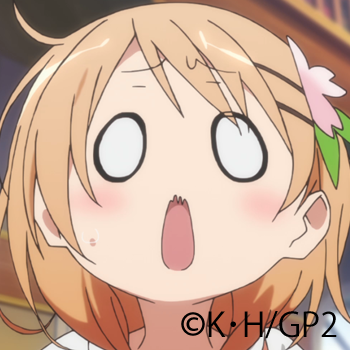
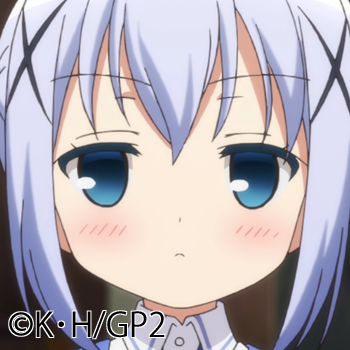
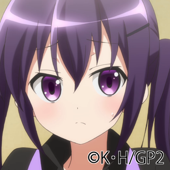

# 登場人物

左から通称 / 本名の順に掲載。

以下、見出しを除き基本的に通称で記述、一部キャラは名前の漢字表記が不明（単行本6巻時点）。

## 主要登場人物

### ココア / 保登 心愛（ほと ここあ）

{#fig:cocoa}

声 - 佐倉綾音

血液型：B型、誕生日：4月10日、身長：154cm、15歳の高校1年→16歳の高校2年→17歳。
4人兄妹の末っ子で、姉（モカ）と2人の兄がいる。

本作の主人公で、高校生。桜の花を半分に切ったような形の髪飾りがトレードマークで、「会って3秒で友達」をモットーとしている。

高校入学を機に木組みの家と石畳の街に引っ越し、喫茶店ラビットハウスに下宿している。

味や香りでの判別はつかないなど、コーヒーには疎かったが（銘柄は知っていた）、ラビットハウスの店員として働くうちに喫茶店に相応の技能を身に付けていっている。

明るく朗らかな性格。
とても前向きではあるが、少々ドジなところがあり、周りからフォローされることが多い。
可愛い物やモフモフしたものが大好きである。
自身が末っ子であるために妹という存在に憧れており、チノのことを実の妹のように可愛がっている。
チノが他の誰かに妹扱いされたり、他の誰かを姉扱いして接したりしていると動揺して泣いてしまう。
一方で、マヤやメグに対しても姉のように振る舞っており、チノから「年下なら誰でもいい」と不満を言われていた。
また、学校ではクラスメート達からみんなの妹扱いされており、そのことに抗議している。

実家はパン屋で、パン作りに懸ける情熱は誰よりも強い。相応の知識や技術も持ち合わせており、ラビットハウスの看板メニューとしてティッピーパンを焼き上げたり、ココア特製厚切りトーストがメニューに追加されたりしている。
しかし姉であるモカの腕前には敵わない模様。
パン作り以外でも、勝負ごとでモカに勝てたことが一度もなく、悔しさのあまりに家出を考えるなど負けず嫌いな一面もある。

天然な雰囲気とは対照的に数学や物理といった理系科目が得意である（本人は自覚していないが暗算も得意で、430×29程度の計算なら瞬時に答えられる）が、
一方では文系科目は壊滅的で、理系科目の足を引っ張っているために学年順位は平均。
それと関連するかどうかは不明だが、チノから教え方が良くないと評されている。
将来の夢について、最初はパン屋や街の国際弁護士に憧れていたが、
バリスタになりたいというチノや小説家である青山ブルーマウンテンの影響により街の国際バリスタ弁護士としてパンを焼きながら小説家の道を生きることを考え始めるなど気が多く、
アコーディオンを買った際は路上ミュージシャンも夢見ていた。

長らく自転車に乗ることができなかったが、リゼの指導の下で練習したことで一応乗れるようになった。
また、アクシデントがあった際には見事なドリフト走行を見せている。

### チノ / 香風 智乃（かふう ちの）

{#fig:chino}

声 - 水瀬いのり

血液型：AB型、誕生日：12月4日、身長：144cm、13歳の中学2年→14歳の中学3年→15歳。

ラビットハウスのオーナーの孫で、看板娘の少女。
薄水色のストレートロングヘアで、髪の左右に×印状のヘアピンを付けている。
学校へ行く時以外はいつもティッピーというアンゴラうさぎを頭に乗せている。
香りだけで産地や銘柄を当てられる程にコーヒーに精通しているが、砂糖とミルクがないと飲めないなど、歳相応な面もある。

クールでおとなしい性格で、誰に対しても敬語で話す。
それ故に、当初はハイテンションで勝手に妹扱いしてくるココアに困惑していたが、
最近ではココアが新しく妹にしたマヤやメグに嫉妬するなど、次第に信頼関係を築いていっている。
同時に、ココアがいずれ自分の元から離れるような発言には動揺を見せている。
ココアが帰省して店にいなくなった時はココアシックに掛かるなど甘えん坊な面があったり、
リゼにより提案された計画表を律儀に守るなどの素直さも持ち合わせているが、
同時に夏休みの宿題を終えていなかったココア達を指導するため最適なインセンティブを与えて手玉に取る様子も見せており、リゼからは教師の才能を感じられていた。

普段はココアに冷たい態度をとることが多く、妹とされることに乗り気ではないが、酔った際はお姉ちゃん子になっていた。
また、子供扱いされることを嫌っており、幼い容姿に若干のコンプレックスを持っているために背を伸ばす効果があるとされる食材や事物には強い関心を示すが、食べ物の好き嫌いはかなり多い。

おじいちゃん子で、将来は家業を継いで立派なバリスタになるのが夢である。
また、家族以外にティッピーの正体（後述）を隠すために普段はティッピーが声を発する時は自分の腹話術であると主張しており、
また基本は人見知りで、昔は祖父や父親以外とは話そうとしなかったために趣味は祖父と嗜んだチェスを除けばボトルシップやパズルなどの一人で遊べる物が多く、
祖父が喫茶店を営んでいなければチェス棋士を目指していた可能性があると語っていた。

可愛い動物、特にうさぎが好きで見つけるといつもより興奮気味になるが、実際は動物が懐かない体質で、ティッピー以外ではあんこしかまともに触れず、他の登場人物が動物と接しているのを見ては羨ましがっている。
また、可愛い動物の童話や本を気に入っており、またリゼにもらったうさぎのぬいぐるみは非常に大切にしているが、うさぎやもふもふという言葉に反応するなどのこの点においてはココアとの共通点が多い。
そのことを指摘されるとココアは大喜びするが逆に本人は動揺し、否定するが、ワイルドギースやあんこの真似をしていたずらしてみたり、リゼやシャロからはココアに似てきたと言われている。

クラスメイトにマヤやメグがおり、リゼからは自身に加えてマヤやメグの頭文字を取って「チマメ（隊）」と呼ばれている。
また、二人とは中学入学時に出会ってシスト（宝探し）に誘われたことから仲良くなっており、最初は将来の夢であるバリスタの意味を勘違いされていたが、
それでもメグの影響でバレエを初めてみたりと繋がりは深く、数少ない友人であることから中学でクラス替えがないことに安心していながらも高校進学に関してはマヤやメグと別れることになってもココアと同じ学校に通うと決めています。

### リゼ / 天々座 理世（てでざ りぜ）

{#fig:rize}

以下略
